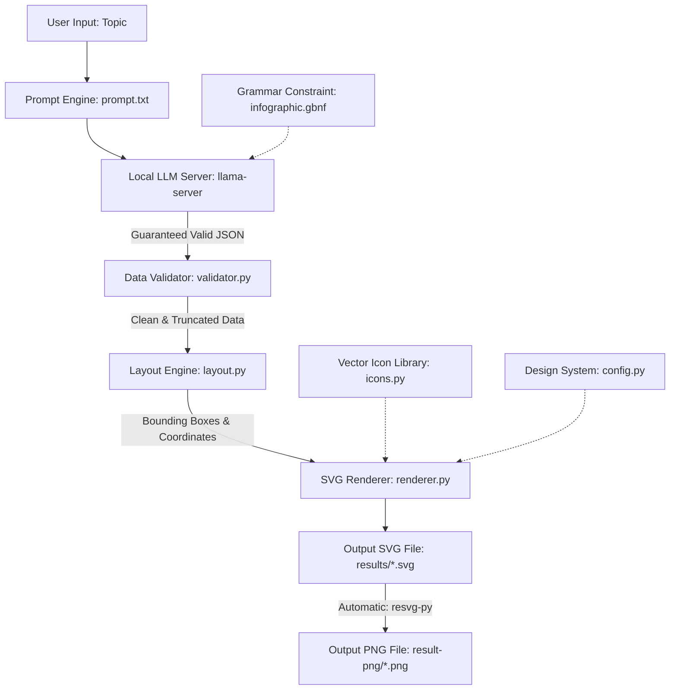

# LatenightPipeline: AI-Directed SVG Infographic Generator

**LatenightPipeline** is an automated, end-to-end pipeline that transforms any natural language topic or concept into a modern, publication-ready vector SVG infographic.

The core architecture follows a strict separation of concerns:
> **"LLM as Art Director, Python as Typesetter and Draftsman"**  
> The Large Language Model (LLM) decides **what** to show, how to structure the story, and what visual metaphors to choose. The deterministic Python engine computes **where** everything goes down to the exact pixel, ensuring zero overlapping text, balanced alignments, clean geometry, and consistent visual aesthetics.

---

## Architecture & End-to-End Pipeline



### The 5 Pipeline Stages

1. **Prompt & Grammar-Constrained Generation (`prompt.txt`, `gen_gbnf.py`, `infographic.gbnf`, `llm.py`)**:
   - The user provides a topic (e.g., *"how an api request works"*).
   - The request is dispatched to a local `llama-server` running a quantized open-weights model (e.g., Qwen 2.5 Coder 3B).
   - A custom **GBNF (GGML BNF) grammar** restricts token sampling at the logits level, guaranteeing that the model produces 100% syntactically valid JSON matching the exact schema—with zero markdown backticks, no explanatory chatter, and strictly valid enums.

2. **Defensive Validation & Sanitization (`validator.py`)**:
   - Validates root keys, array bounds, and field types.
   - Checks that connector references (`from` and `to`) point to actual element IDs.
   - Instead of crashing if the LLM generates overly long text, it automatically applies defensive ellipsis truncation based on configured character limits.

3. **Deterministic Layout Calculation (`layout.py`)**:
   - Divides the 1600x1000 canvas into dynamic vertical regions: Header, Stats Bar (optional), Main Content Area, and Footer.
   - Sizing calculations are **content-aware**: element boxes expand or contract based on title lengths, body text line counts, and geometric shape constraints.
   - Positions elements using one of **8 specialized layout algorithms** (`flow`, `timeline`, `grid`, `two_column`, `centered`, `hub_and_spoke`, `stacked`, `comparison`).
   - Runs **collision detection** and iterative repulsion physics to prevent cards from overlapping.
   - Computes exact connector anchor points at element perimeters using ray-box and circle edge intersections.

4. **Vector Rendering (`renderer.py`, `icons.py`, `config.py`)**:
   - Emits pure, standalone SVG code.
   - Embeds modern design tokens: multi-stop linear gradients, soft SVG drop-shadow filters, card borders, and directional markers.
   - Insets text inside complex shapes (circles, diamonds, hexagons, pills) so lines never clip over edges.
   - Draws SVG vector icons dynamically styled with the element's accent colors.

5. **Automatic PNG Conversion & Artifact Generation (`generate.py`)**:
   - Coordinates the entire execution, file naming, and directory creation.
   - **Always converts the SVG to PNG automatically** into a dedicated `result-png/` folder using `resvg-py` (fast Rust-backed vector rasterizer without external C/DLL runtime dependencies) with a fallback to `CairoSVG`.
   - Supports optional `--debug` visual guide rendering.

---

## Repository File Tree & Components

```
d:\LatenightPipeline\
├── README.md                     # Project overview and system documentation
└── project\
    ├── config.py                 # Design tokens, canvas specs, limits, and server config
    ├── gen_gbnf.py               # Generator script for building foolproof GBNF grammar
    ├── infographic.gbnf          # GBNF grammar constraining LLM JSON output
    ├── prompt.txt                # System prompt guiding LLM as Art Director
    ├── llm.py                    # HTTP client interacting with local llama-server
    ├── validator.py              # Defensive data validation and string truncation
    ├── icons.py                  # Inline SVG vector paths for 8 core icon types
    ├── layout.py                 # Deterministic geometry, sizing, layout & collision engine
    ├── renderer.py               # Vector SVG code builder and typography formatter
    ├── generate.py               # Main CLI runner script (generates both SVG & PNG)
    ├── test_api.py               # Systematic GBNF grammar feature test suite
    ├── results\                  # Generated SVG vector infographics
    │   ├── database-indexes.svg
    │   ├── docker-containers.svg
    │   ├── how-a-compiler-works.svg
    │   ├── how-an-api-request-works.svg
    │   ├── how-an-api-request-works-debug.svg
    │   ├── how-dns-works.svg
    │   ├── how-do-5-systems-communicate-on-a-lan.svg
    │   ├── how-do-5-systems-communicate-on-a-lan-debug.svg
    │   ├── how-does-ci-cd-pipeline-works.svg
    │   ├── jwt-authentication.svg
    │   ├── kubernetes-pod-lifecycle.svg
    │   └── mrpl-refinery-15-00-mmtpa-capacity-13-82-million-t.svg
    └── result-png\               # Automatically converted PNG image results
        ├── database-indexes.png
        ├── docker-containers.png
        ├── how-a-compiler-works.png
        ├── how-an-api-request-works.png
        ├── how-an-api-request-works-debug.png
        ├── how-dns-works.png
        ├── how-do-5-systems-communicate-on-a-lan.png
        ├── how-do-5-systems-communicate-on-a-lan-debug.png
        ├── how-does-ci-cd-pipeline-works.png
        ├── jwt-authentication.png
        ├── kubernetes-pod-lifecycle.png
        └── mrpl-refinery-15-00-mmtpa-capacity-13-82-million-t.png
```

---

## Output Destinations: `results/` vs `result-png/`

The pipeline automatically segregates vector and raster artifacts into two distinct folders for clean file management:

| Folder | Format | File Extension | Engine | Purpose & Use Cases |
| :--- | :--- | :--- | :--- | :--- |
| [`project/results/`](file:///d:/LatenightPipeline/project/results/) | **Vector SVG** | `.svg` | `renderer.py` (pure XML) | Infinite resolution, responsive web embedding, interactive DOM styling, zero quality loss at any scale. |
| [`project/result-png/`](file:///d:/LatenightPipeline/project/result-png/) | **Raster PNG** | `.png` | `resvg-py` (Rust-based) | High-fidelity image previews, social sharing, slides, documentation, and image viewer compatibility. |

### Generation Output Mapping
Whenever you run `generate.py "<topic>"`, the pipeline writes to two destinations in parallel:
```
Topic: "How does CI/CD PIPELINE WORKS"
  ├── Vector SVG  ──► project/results/how-does-ci-cd-pipeline-works.svg
  └── Raster PNG  ──► project/result-png/how-does-ci-cd-pipeline-works.png
```

---

## Recent Pipeline Updates

1. **Mandatory Automatic PNG Rendering**:
   - Previously, PNG generation was optional and required an explicit `--png` flag.
   - PNG generation is now **automatic and enabled by default** on every single execution of `generate.py`. No additional flags are needed.
2. **Dedicated `result-png/` Directory**:
   - PNG files are now routed directly into `project/result-png/` instead of cluttering the SVG `results/` folder.
   - Configured via `RESULTS_PNG_DIR` in [`project/config.py`](file:///d:/LatenightPipeline/project/config.py).
3. **Fixed Windows Cairo DLL Issue (`resvg-py`)**:
   - The initial CairoSVG engine caused `cannot load library 'libcairo-2.dll': error 0x7e` on Windows due to missing GTK/C dependencies.
   - Replaced with **`resvg-py`**, a pre-compiled Rust binary wheel that delivers faster, pixel-perfect SVG-to-PNG rendering on Windows with zero external runtime requirements.


---

## Detailed Component Walkthrough

### 1. Configuration & Design System (`config.py`)
`config.py` acts as the single source of truth for all visual parameters:
- **Canvas Dimensions**: 1600 × 1000 px, 40px top/bottom margins, 60px left/right margins.
- **Spacing Scale**: 5 standard steps from `SPACING_XS` (8px) to `SPACING_XL` (56px).
- **Color Palette**: Modern Slate & Blue UI palette (`#1E293B` text primary, `#475569` text secondary, `#3B82F6` blue accent, `#F59E0B` amber highlight, `#F8FAFC` slate background).
- **Emphasis Levels**: 4 distinct visual card styles:
  - `primary`: Linear blue gradient fill with white text and hover drop-shadow.
  - `highlighted`: Warm amber gradient fill with white text for critical callouts.
  - `secondary`: Soft slate tinted card with muted text.
  - `normal`: Clean white surface with subtle slate border and gentle shadow.
- **Typography Scale**: Defined `TypeStyle` structures with font sizes, weights, line-height multipliers, and semantic color keys for title, subtitle, stat value, stat label, element title, element body, and footer.
- **Character & Array Limits**: Upper bounds on elements (8), stats (4), connectors (10), title length (80), element text (200), etc.

### 2. Prompt & Grammar-Based Sampling (`prompt.txt`, `gen_gbnf.py`, `infographic.gbnf`)
To guarantee that the LLM never produces unparseable output or hallucinated visual parameters:
- `prompt.txt` establishes the persona: *"You are an infographic art director. Given a topic, output ONLY a JSON object for an infographic."* It enforces rules like max 5 words for titles, max 15 words for body text, descriptive labels instead of invented metrics, and defines the allowable vocabulary.
- `infographic.gbnf` is a formal GBNF grammar compiled directly into the sampling engine of `llama-server`. It enforces:
  - Root JSON keys: `title`, `subtitle`, `layout`, `stats`, `elements`, `connectors`, `footer`.
  - Layout enum: `flow | timeline | grid | two_column | centered | hub_and_spoke | stacked | comparison`.
  - Shape enum: `rectangle | rounded_rectangle | circle | diamond | hexagon | pill`.
  - Icon enum: `clock | shield | code | user | database | server | api | cloud`.
  - Size enum: `small | medium | large`.
  - Emphasis enum: `normal | primary | highlighted | secondary`.
  - Connector type enum: `none | line | arrow | dashed_arrow`.

### 3. Local LLM Client (`llm.py`)
- Sends an HTTP POST request to `http://127.0.0.1:8080/completion`.
- Passes the formatted prompt along with the raw GBNF grammar, setting `temperature=0.05` for deterministic, high-fidelity reasoning and `n_predict=4096`.

### 4. Data Validation & Ellipsis Truncation (`validator.py`)
- Verifies JSON structure and required keys.
- Ensures all element IDs are unique.
- Validates that every connector connects valid element IDs (`conn["from"]` and `conn["to"]` must exist in `elements`).
- Truncates strings exceeding configured bounds (`_truncate` adds `...`) rather than failing, making the pipeline resilient to slight model verbosity.

### 5. Deterministic Layout Engine (`layout.py`)
This is the core geometric calculation module:
- **Dynamic Page Regions**: Calculates usable vertical bounds for header, optional stats bar, content area, and footer without hardcoded offsets.
- **Content-Aware Sizing**: Calculates element width and height based on character counts, estimated word wrapping, icon height, and geometry multipliers (e.g., diamonds require ~30% larger dimensions to fit inscribed text).
- **8 Dedicated Layout Strategies**:
  1. `flow`: Horizontal arrangement with multi-row automatic wrapping and vertical centering.
  2. `timeline`: Alternates sequential steps above and below a horizontal central axis.
  3. `grid`: Balanced rows and columns computed using square-root factors with automatic scale-down.
  4. `two_column`: Alternates left and right columns with aligned vertical spacing.
  5. `hub_and_spoke`: Places the central concept at center canvas and computes radial coordinates for satellites using trigonometric angles ($x = cx + r \cos\theta$, $y = cy + r \sin\theta$).
  6. `stacked`: Vertical stack with centered horizontal alignment.
  7. `centered`: Grid layout emphasizing a central primary card.
  8. `comparison`: Equal-width two-column side-by-side comparison.
- **Collision Resolution**: Iterative AABB (Axis-Aligned Bounding Box) intersection test that pushes overlapping elements apart along their displacement vector.
- **Connector Geometry**: Uses ray-box intersection algorithms (and circle radii math) to compute connector endpoints exactly at card borders (+4px clearance), ensuring arrowheads never overlap shape outlines.

### 6. Vector SVG Renderer (`renderer.py` & `icons.py`)
- Generates standard XML SVG with viewport `0 0 1600 1000`.
- Defines reusable SVG `<defs>`:
  - Drop shadow filter `<feDropShadow>` for depth.
  - Linear gradients (`grad-bg`, `grad-primary`, `grad-highlight`).
  - Reusable arrowhead marker `<marker id="arrowhead">`.
- **Card Rendering**: Renders shapes (`<rect>`, `<polygon>`, `<circle>`) with rounded corners, drop shadows, and emphasis fills.
- **Shape-Safe Bounds**: `_get_shape_usable_bounds` calculates safe inner padding for circles, diamonds, and hexagons so wrapped text stays within visible borders.
- **Typography & Centering**: Multi-line wrapped text blocks centered both horizontally and vertically inside element cards.
- **Stats Bar**: Displays key concept chips or metrics in compact cards below the header.
- **Connectors**: Renders line connectors with start-dots, optional dashed strokes, and arrowheads.
- **Debug Mode (`--debug`)**: Renders colored dashed bounding boxes around all page regions and individual elements showing their computed dimensions.

### 7. Icon System (`icons.py`)
Provides lightweight inline SVG path strings designed on a standard 24×24 coordinate viewBox. The renderer scales and translates them cleanly to match card dimensions and colors.

---

## JSON Data Schema

Below is the standard JSON structure produced by the LLM and consumed by the pipeline:

```json
{
  "title": "API Request Flow",
  "subtitle": "Understanding the journey from client to server",
  "layout": "flow",
  "stats": [
    { "label": "Client", "value": "Initiates request" },
    { "label": "Server", "value": "Processes request" }
  ],
  "elements": [
    {
      "id": "client",
      "title": "Client App",
      "text": "Sends HTTP request with headers and payload",
      "shape": "rounded_rectangle",
      "icon": "user",
      "size": "medium",
      "emphasis": "primary"
    },
    {
      "id": "gateway",
      "title": "API Gateway",
      "text": "Authenticates and routes traffic to services",
      "shape": "diamond",
      "icon": "shield",
      "size": "medium",
      "emphasis": "highlighted"
    },
    {
      "id": "server",
      "title": "Backend API",
      "text": "Executes business logic and queries database",
      "shape": "rounded_rectangle",
      "icon": "server",
      "size": "medium",
      "emphasis": "normal"
    },
    {
      "id": "database",
      "title": "Database",
      "text": "Stores and retrieves persistent records",
      "shape": "circle",
      "icon": "database",
      "size": "medium",
      "emphasis": "secondary"
    }
  ],
  "connectors": [
    { "from": "client", "to": "gateway", "type": "arrow" },
    { "from": "gateway", "to": "server", "type": "arrow" },
    { "from": "server", "to": "database", "type": "dashed_arrow" }
  ],
  "footer": "LatenightPipeline • Automated System Architecture Infographics"
}
```

---

## Usage Guide

### Prerequisites
1. **Python 3.10+**
2. **Local Llama Server**:
   Start `llama-server` (from `llama.cpp`) hosting a supported model:
   ```bash
   llama-server -m D:\Qwen\models\qwen2.5-coder-3b-instruct-q4_k_m.gguf --port 8080 -c 4096
   ```
3. **PNG Rendering Engine**:
   `resvg-py` (pre-compiled Rust binary wheel, requires no external C DLLs):
   ```bash
   pip install resvg-py
   ```

### Running the Generator

Generate both SVG (`project/results/`) and PNG (`project/result-png/`) automatically:
```bash
python project/generate.py "How DNS Works"
```

Generate with debug overlays showing region and element bounding boxes:
```bash
python project/generate.py "How an API request works" --debug
```

*(Note: The `--png` flag is preserved for backwards-compatibility, but PNG generation is now automatic for all runs.)*

Generated files:
- **SVG vector**: `project/results/<sanitized-topic>.svg`
- **PNG image**: `project/result-png/<sanitized-topic>.png`

---

## Summary of Key Design Decisions

| Challenge | Solution |
| :--- | :--- |
| **LLM Output Hallucination & Syntax Errors** | Constrained logits sampling via GBNF grammar (`infographic.gbnf`). Zero chance of JSON parse failures or markdown backtick leaks. |
| **Text Overlapping & Card Collision** | Content-aware text line calculation, multi-row flex wrapping, and iterative collision repulsion physics in `layout.py`. |
| **Connectors Piercing Shapes** | Ray-box and circle edge intersection mathematics calculating exact perimeter contact points with a 4px visual clearance. |
| **Shape Text Clipping** | Shape-specific safe inner boundary calculations (`_get_shape_usable_bounds`) preventing text from overflowing diamonds and circular borders. |
| **Design Consistency** | Centralized design tokens in `config.py` with modern drop-shadows, balanced typography scales, and curated emphasis palettes. |
